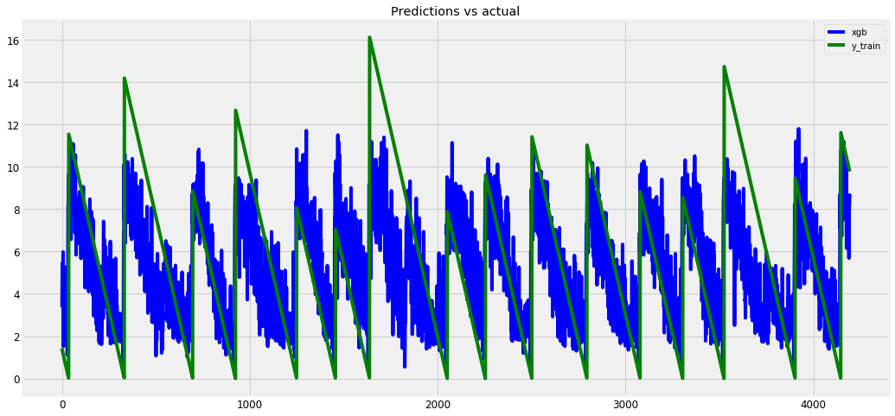

# Laboratory Earthquake Time-to-Failure Prediction

A signal-processing and machine-learning notebook for the [LANL Earthquake Prediction competition](https://www.kaggle.com/competitions/LANL-Earthquake-Prediction). It estimates the time remaining before the next laboratory fault failure from a segment of acoustic measurements.

## Why this project

Laboratory faults reproduce simplified stick-slip failure cycles under controlled conditions. Predicting their time to failure provides a useful benchmark for studying how statistical and frequency-domain patterns in a noisy signal relate to an approaching failure event.

This repository is an educational Kaggle experiment. It does **not** predict natural earthquakes and should not be used as an earthquake-warning system.

## How it works

The notebook:

1. Loads and visualizes the acoustic signal and `time_to_failure` target.
2. Compares the frequency content of high-amplitude and background segments.
3. Downsamples the data by a factor of four to reduce processing cost.
4. Divides the training signal into segments matching the test-segment length.
5. Extracts 17 features, including amplitude statistics, quantiles, signal variation, peak frequency, and spectral power.
6. Standardizes the features and trains XGBoost with five-fold cross-validation.
7. Predicts `time_to_failure` for every test segment and writes `submission.csv`.

## Expected outcome

The saved notebook records a cross-validation mean absolute error of **2.1413 seconds** with a standard deviation of **0.0896 seconds**. It produces 2,624 test predictions in Kaggle's `seg_id,time_to_failure` submission format. Results may vary with package versions or model changes.

## Visual example



*Saved notebook output: XGBoost out-of-fold predictions (blue) compared with the actual laboratory `time_to_failure` target (green) across training segments.*

## Common use cases

The workflow demonstrates techniques that can be adapted to:

- Laboratory fracture and fault experiments.
- Predictive maintenance using vibration or acoustic-emission sensors.
- Remaining-useful-life and time-to-failure regression.
- Feature engineering for long, high-frequency sensor streams.
- Comparing time-domain and frequency-domain failure indicators.

## Reproduce the work

1. Clone the repository and enter it:

   ```bash
   git clone https://github.com/mfakbar/earthquake-prediction.git
   cd earthquake-prediction
   ```

2. Create an environment and install the notebook dependencies:

   ```bash
   python -m venv .venv
   source .venv/bin/activate  # Windows: .venv\Scripts\activate
   pip install jupyter numpy pandas matplotlib seaborn scipy statsmodels tqdm scikit-learn xgboost
   ```

3. Download `train.csv`, `sample_submission.csv`, and the `test` folder from the [Kaggle competition data page](https://www.kaggle.com/competitions/LANL-Earthquake-Prediction/data).

4. Open `LANL_Earthquake_Standard.ipynb`, change the `filepath` variable to the downloaded dataset directory, and run all cells in order:

   ```bash
   jupyter notebook LANL_Earthquake_Standard.ipynb
   ```

The dataset is large: the notebook's saved run took about 19 minutes just to load the training CSV before feature generation and model training.

## Potential development

- Replace hard-coded paths with configuration or command-line arguments.
- Pin dependencies and modernize the legacy XGBoost parameters and prediction API.
- Process the training CSV in chunks to reduce memory use and startup time.
- Validate by complete failure cycles to better represent temporal generalization.
- Add reusable feature-generation modules, automated tests, and saved model artifacts.
- Evaluate richer time-frequency features and alternative regression models against the same validation scheme.
